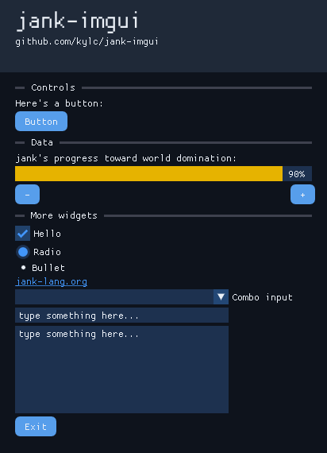

# jank-imgui

[](https://clojars.org/io.github.kylc/jank-imgui)

Create [Dear ImGui](https://github.com/ocornut/imgui) GUIs in jank.



## Requirements

- cmake
- a C++ compiler
- GLFW3
- libGL

## Installation

Add the following dependency to your Leiningen project file:

``` clojure
[io.github.kylc/jank-imgui "0.1.1"]
```

## API docs

See [API.md](./API.md).

## Usage

See the [examples](./examples/).

``` clojure
(ns e01-hello
  (:require
   [imgui.ui :as ui]
   [imgui.backend.glfw-opengl2 :as backend]))

(defn root []
  (ui/with-window {:name "e01-hello"}
    (ui/text "Hello world")))

(defn -main [& args]
  (backend/run {:name "eo1-hello"} #'root))
```
